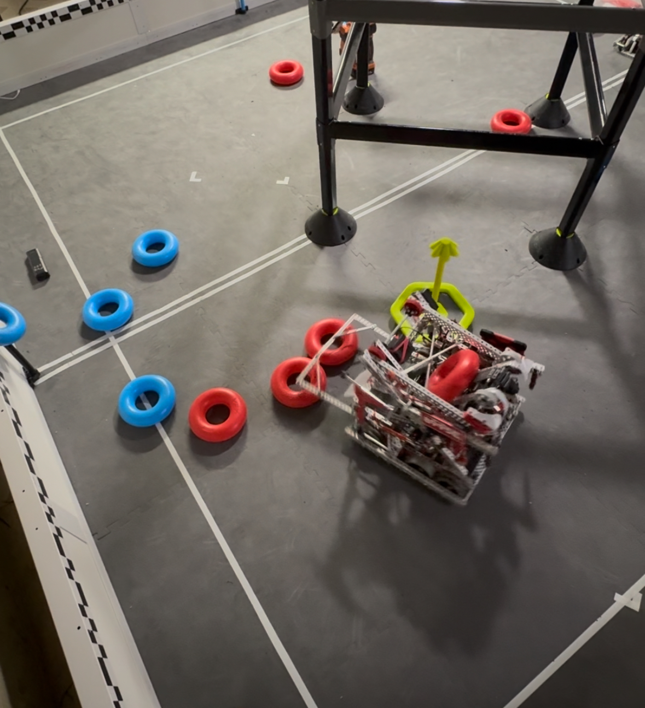

# vexRobotics8995E
8995E 2024-2025 & 2025-2026

This repository contains two projects that we progressed on during the 2024-2025 Vex Robotics season (HIGH STAKES) and one project during the 2025-2026 season (PUSH BACK). 

🔗 [Partial Autonomous Skills Run (SkillsUSA)](https://youtu.be/Cu_Bh399V9Q)

🔗 [Autonomous Route Run 1/8](https://youtube.com/shorts/MEeVSQBVo3U)

### Amster Project
The Amster project utilizes the EZ-Template library. It features completed autonomous routines and relies on the motor's encoders and uses PID controllers for precise movement and control. This project was helpful for consistent, quick, and easy code for all the basic needs of our High Stakes robot. 

### LemTiger Project
The LemTiger project is based on the LemLib library. It includes advanced odometry functions to accurately track the robot's position on the field utilizing dead wheels. This project is designed to provide more precise control and navigation capabilities.

## Getting Started

First, download the PROS extension on VS Code.
To get started with either project, navigate to the respective project directory. 

<u>Amster</u>
This project is dependent on EZ-Template. It will be automatically downloaded when the project is created on VS Code.

<u>Lemtiger</u>
This project is based on Lemlib. Similiarly, all the dependencies will be automatically downloaded when the project is created on VS Code.

## Contact

To create a new project with EZ-Template: [EZ-Template Installation](https://ez-robotics.github.io/EZ-Template/tutorials/installation)

To create a new project with LemLib: [LemLib Getting Started](https://lemlib.readthedocs.io/en/stable/tutorials/1_getting_started.html)

For any questions or support, please contact me at [ethansmanuel@gmail.com].
